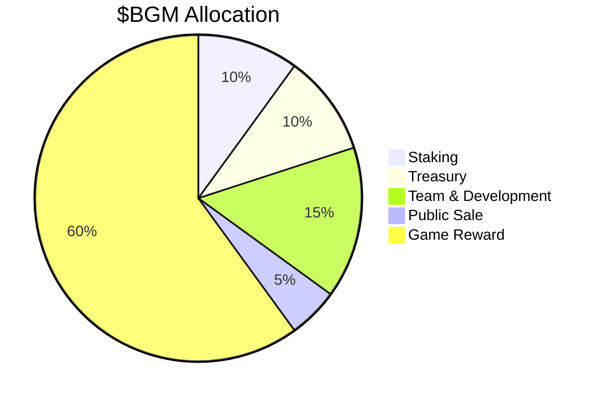

------

## Contributors
- [Bryan Wong Jun Lin](https://github.com/bryanwonggy)
- [Conrad Rein Tang Ze Aw](https://github.com/cReintang)
- [James Mak](https://github.com/jamesmakjxnp)
- [Luther Tan Xin Kang](https://github.com/luthertan98)
- [Seah Zhi Han Mervyn](https://github.com/undeser)

## Content Page
- [Introduction](https://github.com/undeser/Monster-Menagerie#introduction)
  - [Problem Definition](https://github.com/undeser/Monster-Menagerie#problem-definition)
  - [Proposed Solutiion](https://github.com/undeser/Monster-Menagerie#proposed-solution)
  - [Targeted Users](https://github.com/undeser/Monster-Menagerie#targeted-users)
  - [Business Logic](https://github.com/undeser/Monster-Menagerie#business-logic)
  - [Gameplay Logic](https://github.com/undeser/Monster-Menagerie#gameplay-users)
- [Architecture](https://github.com/undeser/Monster-Menagerie#architecture)
  - [System Illustration](https://github.com/undeser/Monster-Menagerie#system-illustration)
  - [How This System Works](https://github.com/undeser/Monster-Menagerie#how-this-system-works)
- [Analyses](https://github.com/undeser/Monster-Menagerie#analyses)
  - [Technical Implementation](https://github.com/undeser/Monster-Menagerie#technical-implementation)
  - [Potential Future Features](https://github.com/undeser/Monster-Menagerie#potential-future-features)

----- 

# Introduction
A project for a module, IS4302 - Blockchain and Distributed Ledeger Technologies, taken in National University of Singapore (NUS) in 2023. The project is a GameFi Dapp.

## Problem Definition
GameFI integrates the concepts of both Non-Fungible Tokens (NFTs) and Decentralised Finance (DeFi) into a game, running blockchain’s financial system more intuitively. With the usage of NFTs, players have full ownership of these assets in a decentralised blockchain game [(Emmert et al., 2022)](https://www.nerdwallet.com/article/investing/gamefi). In essence, GameFi augments and enhances on boring DeFi transactions, adding entertainment and interactivity into blockchain finance and NFT. This allows traders to profit and trade through a gamified experience and social interaction.

With the rise of the popularity of Axie Infinity in 2021, the concepts of GameFi and Play-To-Earn (P2E) were popularised. An economy was created over the Axie Infinity where their main users are coming on the platform to earn a living, giving birth to a new virtual labour force [(Najumi, 2022)](https://sg.news.yahoo.com/rise-axie-infinity-p2e-phenomenon-122158764.html?guccounter=1). Axie Infinity excels at providing a platform and opportunity for users to earn a living. With the ease of accessibility available on the platform, Axie Infinity was attractive especially to low-income workers who lack financial mobility. 

The growth of Axie resulted in the game being overrun by value-extractive users who are extensively selling the tokens to earn a living. Alongside, it led to the P2E phenomenon with the creation of many similar current crypto GameFi projects. However, all these GameFi share a critical flaw, where they lack genuine fun and entertainment value. When the essence of the project is a monetisation model that focuses on generating revenue, the balance of demand and supply collapses, leading to a market full of sellers operating under the greater fool theory[^1] [(Lalani et al., 2022)](https://forkast.news/why-is-p2e-axie-infinity-declining-gamefi/). Ultimately, leading to Axie Infinity and similar GameFi projects’ downfall. 

As Riaz Lalani stated
>“If Axie Infinity has taught us anything, it’s that earning is one thing, but it can’t be everything”.

[^1]: The greater fool theory suggests that one can sometimes make money through the purchase of overvalued assets and selling them for a profit later. As there will always be a buyer willing to pay a higher price.

## Proposed Solution

Our solution, Monster Menagerie, is a GameFi platform to be on the Polygon network, where players are able to trade NFTs. Monster Menagerie packages elements of fun, adventure and competition. Players will be able to mint an ERC-20 token known as Gems ($BGM) using ETH, which can subsequently be used to mint Beasts, a form of NFT. Beasts come with different stats and different rarities. They can be collected and form decks to be used in Fights. By winning Fights, players can acquire more Gems while gaining reputation and glory on the leaderboard. These Beasts can also be traded and auctioned off at the Menagerie, a marketplace for Beasts.

### Augmenting Elements of Fun, Nostalgia & Competition
Taking inspiration from childhood card games like Pokemon, Magic: The Gathering and even Hearthstone, Monster Menagerie, incorporates elements of collection and competition. With the game being centred around the theme of different Beasts, this would emerge the player in a fictitious world of adventure, replicative of games and shows. Additionally, collection of the Beasts not only helps you build and strengthen your deck of Beasts, but it also contributes to a sense of achievement while completing the collection. Lastly, winning Fights grant reputation and matchmaking ranking (MMR), which feeds into the competitive nature of humans. This also incentivises players to collect more Beasts as they would want to collect stronger Beasts to win more Fights. 

### Reason for Blockchain & GameFi
Compared to traditional online card games, the value gained from building Monster Menagerie on the blockchain network is paramount. Outside of financial gains, the reason for blockchain stems from creating value and lifespan for the players’ assets. Traditional online games assets, such as the coins, weapons earned never truly belonged to a player and had no real world value. They are also lost and valueless once the game is irrelevant and the platform shuts down. With the concept of NFT, players can own GameFi’s in-platform assets which can also be transferred across different games and platforms. This creates lifetime value for each player’s assets and an internal economy within the game, paving an economy based on player empowerment. 

## Targeted Users

Our target users are mainly those who are already in the NFT and Defi community who wish to earn from the game and for personal entertainment and pleasure. Additionally, by incorporating elements such as collection and competition, we plan to utilise nostalgia to attract new members of the general public into the Defi community. With easy to use features and simple game mechanics, this provides a small barrier of entry for new users and potential investors.

## Business Logic

Monster Menagerie adopts a **play-AND-earn model**, where gaming allows for an open economy and provides financial benefits to players who play the game. 

### Tokenomics

The Monster Menagerie platform will use a native ERC-20 token, Gems ($BGM), for all in-game transactions. Users will be able to mint Gems using ETH and the tokenomics is designed to have a maximum supply cap of 1,000,000 Gems. The main utility of Gems are: 

- Purchasing of Monster pack / Monster from the Marketplace
- Fighting with other players
- Used to repair cards after battling
- Provide liquidity with USD Coin (USDC) and stake on the platform for reward

To ensure that there is not only inflationary pressure on the token, the Gems token is designed with several sinks, making it a deflationary token. These sinks aim to reduce the overall supply of Gems over time, preserving the token's value and ensuring a healthy balance in the platform's economy.

Some of the deflationary mechanisms built into the Gems token design include:

- Implementing a repair fee in Gems after battling. When cards are damaged during Fights, players will need to use Gems to repair them. 50% of the Gems will be burnt to reduce circulating supply in the market and the remaining will be sent to the treasury. 
- Charging a transaction fee for trades and auctions in the Menagerie Marketplace.
- Implementing a staking mechanism where users can lock their Gems tokens with USDC to provide liquidity to the platform. These locked tokens will be taken out of circulation temporarily, reducing the available supply and contributing to deflationary pressure.

The future implementation details for the tokenomics can be found at [Chapter 3.2.4. BGM Token Release Schedule](https://github.com/undeser/Monster-Menagerie#bgm-token-release). 

### Monster NFTs

By implementing and building our solution on the Blockchain and GameFi network, the game assets gained by the players not only have real world value, but lifetime value. Beasts can be minted as NFTs using Gems ($BGM). Beasts’ stats are generated upon minting, having different Attack Points (AP), Health Points (HP), Rarity type and Natures. These combat stats affect their performance in Fights and their value in the Menagerie Marketplace, which will be briefly discussed in [Chapter 1.4.4 The Menagerie Marketplace](https://github.com/undeser/Monster-Menagerie#the-menagerie-marketplace).

### The Menagerie Marketplace

The Menagerie Marketplace is a centralised marketplace where players can trade and auction their Beasts, offering the players a platform to monetise their in-game assets. With a user-friendly interface, players can list and bid for Beasts with ease and no fuss. Similar to Fights, a portion of the sale price will be charged as platform fee in Gems. Additionally, the Menagerie Marketplace will have integration with popular wallets and platforms for seamless trading and asset management.

### Staking

In an effort to promote price stability and mitigate excessive volatility for the $BGM token, users will be able to stake their Uniswap Liquidity Provider (LP) tokens on the Monster Menagerie platform. To obtain LP tokens, users need to provide liquidity for the $BGM-USDC trading pair on Uniswap. The LP tokens can then be staked on our platform to earn $BGM rewards, incentivising users to contribute liquidity to the trading pair.

### Marketing and User Acquisition

To attract new users and investors, various marketing strategies will be employed, such as collaborating with influencers and content creators in the gaming, NFT, and DeFi spaces, social media marketing on platforms like Twitter, Instagram, and Reddit, and organising in-game events, competitions, and giveaways to promote user engagement and platform growth. 

### Revenue Streams

Monster Menagerie's primary revenue streams include platform fees charged on Beasts minting, trading, and auctioning transactions and fees from Fights.

### Self-Development Retention

Our business model focuses on monetising experience, this way, we can attract players to the game based on skill. This means that players who have devoted time to mastering the game and its mechanics should earn the most. On the other hand, new and lower-skilled players will be incentivised by the future possibilities, rather than the idea of immediate earning. By using the addictive quality of self-improvement, it keeps players interested in the game and creates player retention as they have invested time to learn and master the game. 

In addition, our reward system incentivises players by rewarding them more Gems if they beat a player with higher MMR. Similarly, if a player were to lose to another player with lower MMR, they would also stand to lose more Gems. This system encourages players to come up with new and better strategies in order to beat more skilled players, developing different “metas” and strategies as more Beasts are added to the game. With the Menagerie Marketplace, players can then use those Gems earned to purchase rarer and more powerful cards, this creates more possibilities for players to formulate different strategies, as they have access to a wider variety of cards with different abilities and strengths.

Additionally, the Menagerie Marketplace can provide a sense of progression and achievement for players as they earn more Gems and mint more powerful cards. This can keep players engaged and motivated to continue playing the game, as they work towards acquiring the most powerful cards and achieving victory.

### Roadmap & Development Plan

The development of Monster Menagerie will follow a structured roadmap that includes:

1. Initial development of the platform, including smart contracts, tokenomics, and NFT design (Launch of MVP). This stage focuses on creating the foundation of the Monster Menagerie ecosystem and establishing core functionalities. This is the current stage.
2. Alpha and beta testing to gather user feedback and optimise the platform. During this stage, we will work on refining the platform's front end, ensuring a seamless user experience while addressing any bugs or issues that arise during testing.
3. Development of the Leaderboard and MMR algorithm for the battling function. This stage involves creating a competitive environment for players, implementing a ranking system to match players of similar skill levels, and fostering a sense of achievement and progress.
4. Integration of oracles for NFT mints, NFT minting restrictions, and tokenomics improvement. This stage aims to enhance the platform's security and fairness, ensuring that the minting process is transparent and adheres to the designed rarity distribution.
5. Launching the platform and organising marketing campaigns to acquire users. This stage focuses on promoting Monster Menagerie to the target audience, using various marketing channels and strategies to attract users and establish a strong user base.
6. Regular updates and improvements, including new Monster releases, events, and in-game features. We will continue to enhance the gameplay experience, introducing new content and strategies to keep players engaged and maintain the platform's growth.

By following this roadmap, we aim to create a thriving and sustainable GameFi platform that balances both the entertainment and financial aspects, providing users with a fun, engaging, and rewarding experience.

## Gameplay Logic

### Monster Cards
Each Beast upon minting, will come with a unique combination of Attack Points (AP), Health Points (HP), Rarity, cost and Nature. Both AP and HP are integer values and come in a range. There are four Rarity types[^2] in total – Common, Rare, Epic and Legendary. The cost of the Beasts is dependent on the Rarity type. As of now, there are only three Natures in Monster Menagerie – Verdant, Infernal and Aquatic. 

[^2]: Rarity Types are indicated by the symbol at the top of the cards, represented by different shapes for different Rarity Types.

Defeated Beast cards will be broken after a Fight, rendering them unplayable until fixed. They can be fixed using Gems, where their Rarity type would determine the cost of Gems needed for this process.

### Entering a Fight

Players are required to wager an amount of Gems to participate in a Fight. Apart from wagering (and ensuring that the player has sufficient Gems), players would be required to select five Beasts **in sequence** from their collection to form a Deck. The Deck must have a total cost of no more than 65. After which, they would be placed in a matchmaking lobby where they will be assigned an opponent using our algorithm. 

### Scaling and Nature Advantage

During a Fight, Beasts will fight opponent’s Beasts in the sequence which they were selected (ie. first Beast Fight opponent’s first Beast). Both Beasts’ AP and HP will be scaled using our algorithm. 

The algorithm will consider two factors:
- Cost of each player’s Deck: 
  - The lower the cost of a player’s Deck, the greater the scaling of stats is.
- Nature advantages: 
  - A Beast is considered Nature-advantaged when its Nature is strong against the opponent Beast’s Nature. 
  - Verdant is strong against Aquatic; Aquatic is strong against Infernal; Infernal is strong against Verdant. 
  - There are no Nature “disadvantages”.

### During a Fight

After scaling is done, both Beasts will fight against each other. Each Beast’s scaled HP will be deducted based on the opponent’s scaled AP. If the opponent’s scaled AP exceeds the Beast’s scaled HP, the Beasting card will be broken. Any residual damage will be stored and recorded as Damage Points (DP). If the opponent’s scaled AP does not exceed the scaled HP, nothing happens. This would repeat for each of the five Beasts. The player with the higher Damage Points (DP) would win the game. 

### Victory

Winning a Fight not only allows you to climb the leaderboard, but also gaining MMR and Gems in the process. The winner of the Fight will receive the majority of the pool of wagered Gems, while the remaining is distributed as platform fees.

-----

# Architecture

## System Illustration

```mermaid
classDiagram

class Gem {
    <<Contract>>
    supplyLimit : uint256 
    currentSupply : uint256 
    owner : address
    getGems()
    checkGems()
    checkGemsOf(address user)
    transferGems(address recipient, uint256 value)
    transferGemsFrom(address from, address to, uint256 amt)
    giveGemApproval(address recipient, uint256 amt)
    checkGemAllowance(address user, address spender)
    currentGemSupply()
}

class Fight {
    <<Contract>>
    cardContract : Beasts
    gemContract : Gem
    mmrContract : MMR
    matchmakingQueue : address[]
    owner : address
    _cardsOfPlayersInQueue : mapping(address => uint256[])
    _scale : mapping(address => uint256)
    fight(uint256[] memory cards)
    getElementalScales(uint256 myCard, uint256 enemyCard)
    withdraw()
}

class MMR {
    <<Contract>>
    _playerMMR : mapping(address => uint256)
    isNew(address user)
    initialiseUser(address user)
    getMMR(address user)
    updateMMR(address winner, address loser)
}

class Menagerie {
    <<Contract>>
    cardContract : Beasts
    gemContract : Gem
    owner : address
    listPrices : mapping(unint256 => uint256)
    offers : mapping(uint256 => Offer[])
    list(uint256 id, uint256 price)
    unlist(uint256 id)
    checkPrice(uint256 id)
    makeOffer(uint256 id, uint256 offerPrice)
    checkOffers(uint256 id)
    acceptOffer(uint256 id, address offerer)
    checkOfferExists(uint256 id, address offerer)
    retractOffer(uint256 id)
    buy(uint256 id)
    getContractOwner()
    withdraw()
    checkCommission()
}

Menagerie --> Offer

class Offer {
    <<Struct>>
    owner : address
    offerValue : uint256
    offerCardId: uint256
}

class Beasts {
    <<Contract>>
    gemContract : Gem
    collectionName : string
    collectionSymbol : string
    baseURL : string
    nextTokenIdToMint : uint256
    maxTokens  : uint256
    contractOwner : address
    _owners : mapping(uint256 => address)
    _balances : mapping(adress => uint256)
    _tokenApprovals : mapping(uint256 => address)
    _operatorApprovals : mapping(address => bool)
    _beasts : mapping(uint256 => Beast)
    _cardStates : mapping(uint256 => cardStates)
    _tokenUris : mapping(uint256 => string)

    cardDestroyed(uint256 id)
    cardRevived(uint256 id)
    restoreCard(uint256 id)
    effective(uint256 id, uint256 other_id)
    safeTransferFrom(address _from, address _to, uint256 _tokenId)
    safeTransferFrom(address _from, address _to, uint256 _tokenId, bytes memory _data)
    transferFrom(address _from, address _to, uint256 _tokenId)
    approve(address _approved, uint256 _tokenId)
    getApproved(uint256 _tokenId)
    setApprovalForAll(address _oeprator, bool _approved)
    isApprovedForAll(address _owner, address _owner)
    mint(address _to, string memory bname, string memory rarity, string memory nature, uint256 cost, uint256 attack, uint256 health)
    totalSupply()
    withdraw()
    _checkOnERC721Received(address from, address to, uint256 tokenId, bytes memory data)
    transfer(address _from, address _to, uint256 _tokenId)
    compareStrings(string memory a, string memory b)
    uint2str(uint _i)
    isContract()
    name()
    symbol()
    tokenURI(uint256 _tokenId)
    attackOf(uint256 id)
    healthOf(uint256 id)
    stateOf(uint256 id)
    costOf(uint256 id)
    natureOf(uint256 id)
    nameOf(uint256 id)
    rarirtyOf(uint256 id)
    balanceOf(address _owner)
    ownerOf(uint256 id)
}

Beasts --> Beast
class Beast {
    <<Struct>>
    id : uint256
    name : string
    rarity : string
    nature : string
    cost : uint256
    attack : uint256
    health : uint256
}

Beasts --> cardState
class cardState {
    <<Enum>>
    broken
    functional
}

class LPtoken {
    <<Contract>>
    supplyLimit : uint256
    currentSupply : uint256
    owner : address
    getLPtoken()
    checkLPtoken()
    checkLPtokenOf(address myAdd)
    transferLPtokenFrom(address from, address to, uint256 amt)
    giveLPtokenApproval(address receipt, uint256 amt)
    checkLPtokenAllowance(address user, address spender)
    currentLPtokenSupply()
}

class StakingRewards {
    <<Contract>>
    lpToken : LPtoken
    gem : Gem
    rewardPerSecond : uint256
    totalStakingShares : uint256
    accGemPerShare : uint256
    lastRewardTimeStamp : uint256
    maxDailyReward : uint256
    totalRewardPool : uint256
    owner : address
    stakingPoolLive : bool
    stakers : mapping(address => StakeInfo)

    setStakingPoolLive()
    updatePool()
    pendingReward(address _user)
    stake(uint256 amountToStake)
    withdraw(uint256 amountToWithdraw)
    claimReward()
}

StakingRewards --> StakeInfo
class StakeInfo {
    <<Struct>>
    amount : uint256
    rewardDebt : uint256
}
```

## How This System Works

The four main features available for the users are the minting of Beasts, fighting others' Beasts, listing and purchasing Beasts on the Menagerie Marketplace and staking of LPTokens. In this section, we will be illustrating the flow of main features through the use of user flow diagrams.

### Mint Beast

Users will be able to purchase $BGM from our platform and mint 1 Beast (NFT) for 5 $BGM. The Beast minted can be used in Monster Menagerie to fight others' Beasts. The generation of the attributes of the Beast is random, with the highest probability to get Common Beasts and the lowest probability to get Legendary Beasts.

### Fight other Beasts
Users can pit their Beasts against others' Beasts and earn Gems when they win, based on the difference in damage dealt to the opponent and the damage received from the opponent. At the end of each fight, if the Beast's health goes to 0, it will be destroyed and can only be revived if the owner of the Beast pays a specified amount of Gems to the system.

### Listing and Purchasing Beasts
Users can list their Beasts for sale on the Menagerie Marketplace at their desired price. Prospective buyers can either buy at the listed price, or make an offer with their own asking price. Sellers can then accept their most preferred offer. The Menagerie Marketplace will earn 5% commission on every successful sale which is paid by the buyer.

### Staking of LPTokens
Users can obtain the Liquidity Provider (LP) token by providing liquidity for the $BGM-USDC trading pair on Uniswap. The LP token can be staked on our platform to earn $BGM rewards. The incentivisation will last a year and the reward per second will be fixed. After the incentivisation ends, we will determine if a top-up of $BGM rewards is required to bring in liquidity or if the liquidity pool is self-sustainable using its trading fees. The rewards for stakers are dependent on the proportion it holds in the pool and how long it has been staking. The primary objective of the staking pool is to encourage individuals to contribute liquidity to the trading pair, thereby promoting price stability and mitigating excessive volatility for the $BGM token. Stakers are able to claim,  withdraw and check their rewards at any point of time just by calling the appropriate function. 

-----

# Analyses

## Technical Implementation

### Gems Contract ($BGM)

- ERC20 implementation
  - Gem is ERC20 with a maximum supply of 1 Million BGM Tokens.

- 1e18 Denomination
  - Everything is handled at a scale of 1e18 so that when deployed on testnet or mainnet, 1 Gem is shown as 1 BGM instead of 0.000000000000000001 BGM.

- Gem Functions
  - Gem functions take in and return proper Gem amounts instead of in 1e18 Denomination so other contracts can interact with it using intuitive numbers.

- Mint, Allowance and Transfer
  - Users and contracts can supply ETH to get Gems, provide approval for other addresses to spend a certain amount of their Gems, and transfer their own Gems or the Gems of other addresses (if given allowance) to another address.

### Staking of $BGM - $USDC Liquidity Provider (LP) Token

- Staking contract
  - It interacts with two token contracts - the LP token being staked and Gems being distributed as rewards. The staking contract stores information about the staking pool, individual user stakes, and reward distribution.

- Reward Distribution
  - The contract calculates pending rewards for each user based on their staked amount and the time they have staked. This is done using the *accGemPerShare* variable, which represents the accumulated rewards per share for the entire staking pool. The *rewardDebt* variable in the *StakeInfo* struct is used to track the reward amount already accounted for the user.

Overall, the staking contract serves as an intermediary between users and the token contracts, managing the staking process, updating the reward distribution, and ensuring that users receive the correct proportion of rewards based on their staked amount and the time they have staked.

### Beasts

- ERC721 Implementation
  - BeastCard is implemented following the ERC721 standard.
 
- OpenSea compatible
  - BeastCard uses additional methods that are interrogated by Opensea to be displayed on the site, and BeastCard metadata are stored on IPFS in OpenSea JSON format so that OpenSea can properly query and display the NFT name, image, description and other attributes. 

- Double storage of NFT metadata
  - Beast metadata has to be stored on IPFS so Opensea can query the data for buyers and sellers to know the attributes and determine its value. The metadata (except for the image) also has to be stored on-chain so that Fight contract can perform game logic with it. Otherwise, an oracle would have to be used to query data from IPFS to perform game logic.

- Proof of Concept Deployed:
  - [Link to deployed BeastCard on testnet OpenSea](https://testnets.opensea.io/collection/beast-fight-cards)
  - [Link to BeastCard NFT metadata on IPFS](https://ipfs.io/ipfs/bafybeihjukhqan3okv5kpoqh6aqxmncjp75a76rgmm6zet6x3l7kugck5e/)
  - [Link to deployed BGM contract on Goerli Etherscan](https://goerli.etherscan.io/token/0x4c80168dfb589baabe4563bf038ec65e7e2a6df1)
  - [Link to deployed BeastCard contract on Goerli Etherscan](https://goerli.etherscan.io/address/0x9a0d867c26200fe8fe07478e7cfcd385cbbddc14)

- Minting 
  - As this contract is meant to be interacted through a front end, users do not have to manually input their address and NFT metadata into the mint function. The javascript will query the metadata from IPFS API to instantiate the card with the corresponding metadata to the user’s address, these data are stored in mappings and Beast structure.

- Approval
  - Users can give approval to another address to transfer one or all of their NFTs. This is meant for marketplaces like OpenSea and The Menagerie Marketplace to transfer sold NFTs without having to first transfer ownership of the NFT to the intermediary to list them.
 
- Safe Transfer 
  - Transfer of NFTs should use the safeTransfer functions to prevent the NFT from being transferred to an incompatible wallet address and become lost.

### Fight

- Matchmaking
  - Due to the short timeline for this project, the matchmaking system currently allows a player ready to fight to enter a matchmaking queue if there is no one currently in the queue. If the queue is not empty, the first player will be matchmade to the player trying to enter a fight.

- Cost Scaling 
  - To allow new players to have a shot at winning fights, we have implemented cost scaling, where players’ Beasts get buffed based on the difference of the maximum cost and the team’s cost. 
  - $scale = \frac{(65 - cost)}{10} + 10$
  - For instance, a team that has a cost of 65 will have a scale of 10 while a team that has a cost of 45 will have a scale of 12, which is 20% higher than the former’s scale.

- Nature Scaling
  - When a Beast’s nature is effective to another Beast’s nature, the former will have its AP and HP buffed by 10%, while the latter will remain constant. 

- Calculation of Rewards for Winner 
  - Based on the difference in damage dealt to each team, the winner of the fight will be the team that dealt more damage to the opponent. The amount of gems that the loser loses will be the damage difference divided by 100. Of which, 90% will go to the winner of the fight and 10% will go to the Fight contract as a form of commission fee.

### Menagerie Marketplace

The Menagerie Marketplace is a marketplace where players can sell and buy cards belonging to other players. The Menagerie Marketplace charges a 5% commission fee for every successful sale of a BeastCard, which is paid by the buyer. This commission belongs to the contract owner of the Menagerie Marketplace.

- List and Unlist
  - BeastCard owners can list their card for sale, specifying an amount of BGM as the price. They can also Unlist their card if they do not wish to sell the card anymore, or wish to change the price of the listed card.

- checkPrice and Buy
  - Prospective buyers are able to check the price of the listed card, and subsequently purchase the card.

- makeOffer and retractOffer
  - Prospective buyers are also able to offer their own price for a particular listed BeastCard. Each buyer can only have one offer for a particular card. If they wish to change their offered price, they retract the offer and make another offer.

- checkOffers and acceptOffer
  - BeastCard owners who list their card for sale can check all the available offers that other prospective buyers made for their card. They can then accept the offer of their preference.

- withdraw and checkCommission
  - The contract owner can check the amount of commission earned from the sale of BeastCards, and subsequently withdraw the amount of BGM from the Menagerie Marketplace contract.

## Potential Future Features

### Leaderboard

A leaderboard based on the MMR could be created to incentivise users to fight more, since a place on the leaderboard gives the user bragging rights. Furthermore, we could share a portion of the commissions we made from all the fights and distribute it amongst the top 10 highest MMR users in the game, incentivising users to play more to earn more MMR.

### Matchmaking Ranking (MMR) Algorithm

Currently, we are using constants to determine the MMR change for different scenarios, whether the winner has a higher or lower MMR than the loser. However, we understand that this may not be the best way to control the MMR of the users and this current system could be manipulated by users. Therefore, in the future, we could implement an ingenious algorithm to prevent such manipulations from happening and change the MMR of users more fairly after each fight.

### Using Oracles

We could also implement a minting system whereby card properties like rarity, name, image, attack, cost, and health are randomly generated via Chainlink’s Verifiable Random Function, and post these data to IPFS when a new card is minted. This will allow the contract to mint unique cards (unique images and stats) in a truly random way instead of from a list of pre-generated random data like we are currently doing. Keeping RNG off chain will also help maintain the protocol’s resistance to manipulation by users trying to get good card attributes.

We could also use oracles like Chainlink to query data from IPFS to run game logic if it is not too expensive to do so, so that we do not have to store a second set of NFT metadata on-chain to run the game logic.

### BGM Token Release Schedule

Currently, our tokens supply increases when minted by users. This results in a very unstable tokenomics as users enter the game and will result in low liquidity token trading as demand is fulfilled via minting. This is bad for the game economy, and we should plan and broadcast a proper token release schedule so that users are aware of how tokens are emitted and can make their decisions with greater clarity. Below is a proposed $BGM token allocation:

Under this token release schedule, tokens will be emitted to early players who play the game for a set period, until maximum supply is reached. This will incentivise users to try out the game during the early days and penetrate the gaming market. Tokens are also allocated to fund the staking rewards, build up a treasury, and to compensate the team. Instead of allowing users to continue to mint tokens until maximum supply is reached, a public sale will be held to generate revenue for the protocol and release the initial supply of tokens to the market.

### Staking Rewards Sustainability

Once maximum supply is reached, staking rewards from token emissions will dry up and lose its incentive. We should plan ahead and implement a more sustainable approach to incentivising locked liquidity. As such, we should share part of the protocol’s revenue from fights and Menagerie Marketplace trading fees to fund the staking rewards, allowing a circular economy of token flow for better sustainability.

### NFT Minting Restrictions

Similar to our token emissions, we should conduct a formal NFT sale event where the total supply of the batch of Beast cards is up for sale so that demand for Beast cards from then on will be supplied by the secondary market. With this, we can revise the cost of minting and limit the number of cards a single user can mint, so as to deter a single person from dominating the secondary market and ruining the economy.

### More Strategy Potential in Gameplay

We could also try to incorporate more game logic so that players have more avenues to strategise to win, such as specific card combos. For instance, we could create more classes of monsters such as Dragons or more types of nature, which could be used to form combos to boost the AP and HP of the deck.

